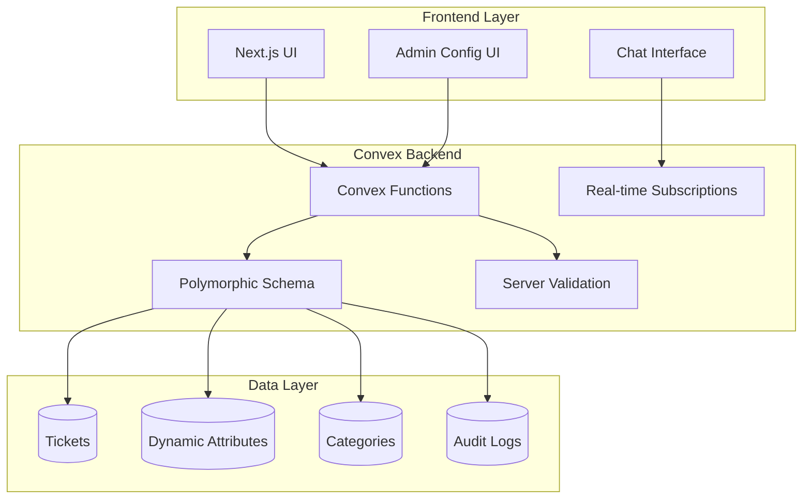
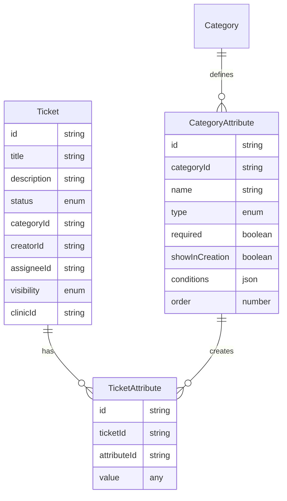

# Design Document

## Overview

Il sistema Core Ticket Features è progettato come un'evoluzione del sistema esistente, focalizzandosi su semplicità d'uso, configurabilità avanzata e architettura polimorfa. Utilizza Next.js + Convex per garantire security-first e velocity-first, con interfacce intuitive per admin non tecnici e esperienza chat-like per gli utenti.

### Design Principles
- **Security First**: Zero esposizioni API, tutto tramite Convex
- **Velocity First**: Interfacce reattive e performanti
- **Polymorphic Architecture**: Strutture dati flessibili e adattabili
- **Admin-Friendly**: Configurazioni intuitive per non tecnici
- **Scalable**: Architettura pronta per crescita e personalizzazioni

## Architecture

### High-Level Architecture



### Polymorphic Data Architecture



## Components and Interfaces

### Core Data Models

#### Enhanced Ticket Schema
```typescript
// Estensione dello schema esistente
export const tickets = defineTable({
  // Campi base esistenti
  title: v.string(),
  description: v.string(),
  status: v.union(
    v.literal("open"),      // Semplificato: solo 3 stati
    v.literal("in_progress"),
    v.literal("closed")
  ),
  categoryId: v.id("categories"),
  clinicId: v.id("clinics"),
  creatorId: v.id("users"),
  assigneeId: v.optional(v.id("users")),
  
  // Nuovi campi per configurabilità
  visibility: v.union(v.literal("public"), v.literal("private")),
  
  // Metadati per performance
  lastActivityAt: v.number(),
  attributeCount: v.number(), // per ottimizzazioni query
})
.index("by_clinic_status", ["clinicId", "status"])
.index("by_assignee_status", ["assigneeId", "status"])
.index("by_creator", ["creatorId"])
.index("by_activity", ["lastActivityAt"]);

// Nuova tabella per attributi dinamici
export const categoryAttributes = defineTable({
  categoryId: v.id("categories"),
  name: v.string(),
  slug: v.string(),                    // per identificazione univoca
  type: v.union(
    v.literal("text"),
    v.literal("number"),
    v.literal("date"),
    v.literal("select"),
    v.literal("multiselect"),
    v.literal("boolean")
  ),
  required: v.boolean(),
  showInCreation: v.boolean(),
  showInList: v.boolean(),
  order: v.number(),
  
  // Configurazione tipo-specifica
  config: v.object({
    placeholder: v.optional(v.string()),
    options: v.optional(v.array(v.string())), // per select/multiselect
    min: v.optional(v.number()),              // per number/text length
    max: v.optional(v.number()),
    defaultValue: v.optional(v.any()),
  }),
  
  // Condizioni per visibilità dinamica
  conditions: v.optional(v.object({
    field: v.string(),
    operator: v.string(),
    value: v.any(),
  })),
  
  clinicId: v.id("clinics"),
  isActive: v.boolean(),
})
.index("by_category", ["categoryId"])
.index("by_clinic", ["clinicId"])
.index("by_creation", ["categoryId", "showInCreation"])
.index("by_order", ["categoryId", "order"]);

// Valori degli attributi
export const ticketAttributes = defineTable({
  ticketId: v.id("tickets"),
  attributeId: v.id("categoryAttributes"),
  value: v.any(), // Valore polimorfo basato sul tipo
})
.index("by_ticket", ["ticketId"])
.index("by_attribute", ["attributeId"])
.index("by_ticket_attribute", ["ticketId", "attributeId"]);
```

### Admin Configuration Interface

#### Attribute Builder Component
```typescript
interface AttributeBuilderProps {
  categoryId: string;
  onSave: (attribute: CategoryAttribute) => void;
}

interface CategoryAttribute {
  name: string;
  type: AttributeType;
  required: boolean;
  showInCreation: boolean;
  showInList: boolean;
  config: AttributeConfig;
  conditions?: AttributeCondition;
}

interface AttributeConfig {
  placeholder?: string;
  options?: string[];      // per select/multiselect
  min?: number;           // per validazioni
  max?: number;
  defaultValue?: any;
}

interface AttributeCondition {
  field: string;          // campo da controllare
  operator: 'equals' | 'not_equals' | 'contains' | 'greater_than' | 'less_than';
  value: any;
}

// Componente drag-and-drop per riordinamento
const AttributeBuilder: React.FC<AttributeBuilderProps> = ({ categoryId, onSave }) => {
  const [attributes, setAttributes] = useState<CategoryAttribute[]>([]);
  const [previewMode, setPreviewMode] = useState(false);
  
  return (
    <div className="grid grid-cols-2 gap-6">
      {/* Builder Panel */}
      <div className="space-y-4">
        <DragDropContext onDragEnd={handleDragEnd}>
          <Droppable droppableId="attributes">
            {(provided) => (
              <div {...provided.droppableProps} ref={provided.innerRef}>
                {attributes.map((attr, index) => (
                  <AttributeCard 
                    key={attr.id} 
                    attribute={attr} 
                    index={index}
                    onEdit={handleEdit}
                    onDelete={handleDelete}
                  />
                ))}
                {provided.placeholder}
              </div>
            )}
          </Droppable>
        </DragDropContext>
        
        <AddAttributeButton onClick={handleAddAttribute} />
      </div>
      
      {/* Preview Panel */}
      <div className="border-l pl-6">
        <h3>Anteprima Form Creazione Ticket</h3>
        <TicketFormPreview 
          categoryId={categoryId}
          attributes={attributes}
        />
      </div>
    </div>
  );
};
```

### Dynamic Ticket Creation Form

#### Smart Form Component
```typescript
interface DynamicTicketFormProps {
  onSubmit: (ticket: CreateTicketData) => void;
}

interface CreateTicketData {
  title: string;
  description: string;
  categoryId: string;
  attributes: Record<string, any>;
  visibility?: 'public' | 'private';
}

const DynamicTicketForm: React.FC<DynamicTicketFormProps> = ({ onSubmit }) => {
  const [selectedCategory, setSelectedCategory] = useState<string>('');
  const [formData, setFormData] = useState<CreateTicketData>({
    title: '',
    description: '',
    categoryId: '',
    attributes: {},
  });
  
  // Carica attributi dinamicamente quando cambia categoria
  const categoryAttributes = useQuery(api.categoryAttributes.getByCategory, {
    categoryId: selectedCategory,
    showInCreation: true,
  });
  
  // Valida condizioni per mostrare/nascondere campi
  const visibleAttributes = useMemo(() => {
    return categoryAttributes?.filter(attr => {
      if (!attr.conditions) return true;
      
      const fieldValue = formData.attributes[attr.conditions.field];
      return evaluateCondition(fieldValue, attr.conditions);
    }) || [];
  }, [categoryAttributes, formData.attributes]);
  
  return (
    <form onSubmit={handleSubmit} className="space-y-6">
      {/* Campi base sempre visibili */}
      <div className="grid grid-cols-1 gap-4">
        <Input
          label="Titolo"
          value={formData.title}
          onChange={(value) => setFormData(prev => ({ ...prev, title: value }))}
          required
        />
        
        <Textarea
          label="Descrizione"
          value={formData.description}
          onChange={(value) => setFormData(prev => ({ ...prev, description: value }))}
          required
        />
        
        <CategorySelect
          value={selectedCategory}
          onChange={setSelectedCategory}
          required
        />
      </div>
      
      {/* Attributi dinamici */}
      {visibleAttributes.length > 0 && (
        <div className="border-t pt-6">
          <h3 className="text-lg font-medium mb-4">Informazioni Aggiuntive</h3>
          <div className="grid grid-cols-1 gap-4">
            {visibleAttributes.map(attribute => (
              <DynamicAttributeField
                key={attribute.id}
                attribute={attribute}
                value={formData.attributes[attribute.slug]}
                onChange={(value) => handleAttributeChange(attribute.slug, value)}
              />
            ))}
          </div>
        </div>
      )}
      
      {/* Controlli visibilità se abilitati */}
      {clinicSettings?.allowPublicTickets && (
        <div className="border-t pt-6">
          <VisibilityToggle
            value={formData.visibility}
            onChange={(visibility) => setFormData(prev => ({ ...prev, visibility }))}
          />
        </div>
      )}
      
      <Button type="submit" className="w-full">
        Crea Ticket
      </Button>
    </form>
  );
};
```

### Chat-like Ticket Interface

#### Ticket Chat View
```typescript
interface TicketChatViewProps {
  ticketId: string;
}

const TicketChatView: React.FC<TicketChatViewProps> = ({ ticketId }) => {
  const ticket = useQuery(api.tickets.getById, { ticketId });
  const comments = useQuery(api.comments.getByTicket, { ticketId });
  const currentUser = useQuery(api.users.getCurrentUser, {});
  
  const canEditTicket = ticket?.creatorId === currentUser?.id;
  const canManageTicket = currentUser?.role === 'agent' || currentUser?.role === 'admin';
  
  return (
    <div className="flex flex-col h-full">
      {/* Header con titolo e controlli */}
      <div className="border-b p-4">
        <div className="flex items-center justify-between">
          <div className="flex-1">
            {canEditTicket ? (
              <EditableTitle
                value={ticket?.title}
                onChange={handleTitleChange}
              />
            ) : (
              <h1 className="text-xl font-semibold">{ticket?.title}</h1>
            )}
          </div>
          
          {canManageTicket && (
            <div className="flex items-center space-x-2">
              <StatusBadge status={ticket?.status} />
              <AssigneeSelect
                value={ticket?.assigneeId}
                onChange={handleAssigneeChange}
              />
              <StatusSelect
                value={ticket?.status}
                onChange={handleStatusChange}
              />
            </div>
          )}
        </div>
        
        {/* Attributi del ticket */}
        <TicketAttributes ticketId={ticketId} />
      </div>
      
      {/* Area chat */}
      <div className="flex-1 overflow-y-auto p-4 space-y-4">
        {/* Messaggio iniziale con descrizione */}
        <ChatMessage
          author={ticket?.creator}
          timestamp={ticket?.createdAt}
          isInitial={true}
        >
          {canEditTicket ? (
            <EditableDescription
              value={ticket?.description}
              onChange={handleDescriptionChange}
            />
          ) : (
            <div className="prose prose-sm">{ticket?.description}</div>
          )}
        </ChatMessage>
        
        {/* Commenti */}
        {comments?.map(comment => (
          <ChatMessage
            key={comment.id}
            author={comment.author}
            timestamp={comment.createdAt}
          >
            {comment.content}
          </ChatMessage>
        ))}
      </div>
      
      {/* Input nuovo commento */}
      <div className="border-t p-4">
        <CommentInput
          onSubmit={handleAddComment}
          placeholder="Scrivi un commento..."
        />
      </div>
    </div>
  );
};
```

## Data Models

### Polymorphic Attribute System

#### Attribute Type Definitions
```typescript
type AttributeType = 
  | 'text'
  | 'number' 
  | 'date'
  | 'select'
  | 'multiselect'
  | 'boolean';

interface AttributeTypeConfig {
  text: {
    placeholder?: string;
    minLength?: number;
    maxLength?: number;
    pattern?: string;
  };
  number: {
    min?: number;
    max?: number;
    step?: number;
    unit?: string;
  };
  date: {
    minDate?: string;
    maxDate?: string;
    format?: string;
  };
  select: {
    options: string[];
    allowOther?: boolean;
  };
  multiselect: {
    options: string[];
    minSelections?: number;
    maxSelections?: number;
  };
  boolean: {
    trueLabel?: string;
    falseLabel?: string;
  };
}
```

#### Dynamic Validation System
```typescript
// Convex function per validazione dinamica
export const validateTicketAttributes = internalMutation({
  args: {
    categoryId: v.id("categories"),
    attributes: v.any(),
  },
  handler: async (ctx, { categoryId, attributes }) => {
    const categoryAttributes = await ctx.db
      .query("categoryAttributes")
      .withIndex("by_category", (q) => q.eq("categoryId", categoryId))
      .filter((q) => q.eq(q.field("isActive"), true))
      .collect();
    
    const errors: ValidationError[] = [];
    
    for (const attr of categoryAttributes) {
      const value = attributes[attr.slug];
      
      // Controlla campi obbligatori
      if (attr.required && (value === undefined || value === null || value === '')) {
        errors.push({
          field: attr.slug,
          message: `${attr.name} è obbligatorio`,
        });
        continue;
      }
      
      // Validazione tipo-specifica
      if (value !== undefined && value !== null) {
        const typeError = validateAttributeType(attr, value);
        if (typeError) {
          errors.push({
            field: attr.slug,
            message: typeError,
          });
        }
      }
    }
    
    return errors;
  },
});

function validateAttributeType(
  attribute: CategoryAttribute, 
  value: any
): string | null {
  switch (attribute.type) {
    case 'text':
      if (typeof value !== 'string') return 'Deve essere un testo';
      if (attribute.config.minLength && value.length < attribute.config.minLength) {
        return `Minimo ${attribute.config.minLength} caratteri`;
      }
      if (attribute.config.maxLength && value.length > attribute.config.maxLength) {
        return `Massimo ${attribute.config.maxLength} caratteri`;
      }
      break;
      
    case 'number':
      const num = Number(value);
      if (isNaN(num)) return 'Deve essere un numero';
      if (attribute.config.min !== undefined && num < attribute.config.min) {
        return `Valore minimo: ${attribute.config.min}`;
      }
      if (attribute.config.max !== undefined && num > attribute.config.max) {
        return `Valore massimo: ${attribute.config.max}`;
      }
      break;
      
    case 'select':
      if (!attribute.config.options?.includes(value)) {
        return 'Valore non valido';
      }
      break;
      
    case 'multiselect':
      if (!Array.isArray(value)) return 'Deve essere una lista';
      const invalidOptions = value.filter(v => !attribute.config.options?.includes(v));
      if (invalidOptions.length > 0) {
        return 'Contiene valori non validi';
      }
      break;
  }
  
  return null;
}
```

## Error Handling

### Graceful Degradation Strategy

#### Client-Side Error Boundaries
```typescript
class TicketErrorBoundary extends React.Component<
  { children: React.ReactNode },
  { hasError: boolean; error?: Error }
> {
  state = { hasError: false, error: undefined };
  
  static getDerivedStateFromError(error: Error) {
    return { hasError: true, error };
  }
  
  componentDidCatch(error: Error, errorInfo: React.ErrorInfo) {
    // Log error per debugging
    console.error('Ticket Error:', error, errorInfo);
    
    // Invia telemetria se configurata
    if (typeof window !== 'undefined' && window.analytics) {
      window.analytics.track('Ticket Error', {
        error: error.message,
        stack: error.stack,
        componentStack: errorInfo.componentStack,
      });
    }
  }
  
  render() {
    if (this.state.hasError) {
      return (
        <div className="p-6 text-center">
          <h2 className="text-lg font-semibold text-red-600 mb-2">
            Ops! Qualcosa è andato storto
          </h2>
          <p className="text-gray-600 mb-4">
            Si è verificato un errore durante il caricamento del ticket.
          </p>
          <Button 
            onClick={() => this.setState({ hasError: false, error: undefined })}
            variant="outline"
          >
            Riprova
          </Button>
        </div>
      );
    }
    
    return this.props.children;
  }
}
```

#### Convex Error Handling
```typescript
// Utility per gestione errori consistente
export class TicketError extends ConvexError {
  constructor(
    message: string,
    public code: string,
    public details?: any
  ) {
    super(message);
  }
}

// Wrapper per funzioni Convex con error handling
export function withErrorHandling<T extends any[], R>(
  fn: (...args: T) => Promise<R>
) {
  return async (...args: T): Promise<R> => {
    try {
      return await fn(...args);
    } catch (error) {
      if (error instanceof ConvexError) {
        throw error; // Re-throw Convex errors as-is
      }
      
      // Log unexpected errors
      console.error('Unexpected error in Convex function:', error);
      
      throw new TicketError(
        'Si è verificato un errore interno',
        'INTERNAL_ERROR',
        { originalError: error instanceof Error ? error.message : String(error) }
      );
    }
  };
}
```

## Testing Strategy

### Component Testing Approach
```typescript
// Test per Dynamic Ticket Form
describe('DynamicTicketForm', () => {
  it('should show category-specific attributes when category is selected', async () => {
    const mockAttributes = [
      {
        id: '1',
        name: 'Urgenza',
        type: 'select',
        options: ['Bassa', 'Media', 'Alta'],
        showInCreation: true,
      },
    ];
    
    render(
      <ConvexProvider client={mockConvexClient}>
        <DynamicTicketForm onSubmit={jest.fn()} />
      </ConvexProvider>
    );
    
    // Seleziona categoria
    const categorySelect = screen.getByLabelText('Categoria');
    fireEvent.change(categorySelect, { target: { value: 'maintenance' } });
    
    // Verifica che gli attributi appaiano
    await waitFor(() => {
      expect(screen.getByLabelText('Urgenza')).toBeInTheDocument();
    });
  });
  
  it('should validate required attributes before submission', async () => {
    // Test validazione campi obbligatori
  });
  
  it('should hide/show attributes based on conditions', async () => {
    // Test logica condizionale
  });
});

// Test per Admin Attribute Builder
describe('AttributeBuilder', () => {
  it('should allow drag and drop reordering of attributes', () => {
    // Test drag & drop
  });
  
  it('should show live preview of form changes', () => {
    // Test preview in tempo reale
  });
});
```

### Performance Testing
```typescript
// Test performance per grandi dataset
describe('Ticket Performance', () => {
  it('should handle 1000+ tickets without performance degradation', async () => {
    const startTime = performance.now();
    
    // Simula caricamento 1000 ticket
    const tickets = await loadTickets({ limit: 1000 });
    
    const endTime = performance.now();
    const loadTime = endTime - startTime;
    
    expect(loadTime).toBeLessThan(2000); // Max 2 secondi
    expect(tickets).toHaveLength(1000);
  });
  
  it('should efficiently query tickets with complex attribute filters', async () => {
    // Test query performance con filtri complessi
  });
});
```

Questo design mantiene la flessibilità e scalabilità richieste, mentre fornisce un'esperienza utente semplice e intuitiva per tutti i tipi di utenti, dai non tecnici agli amministratori esperti.